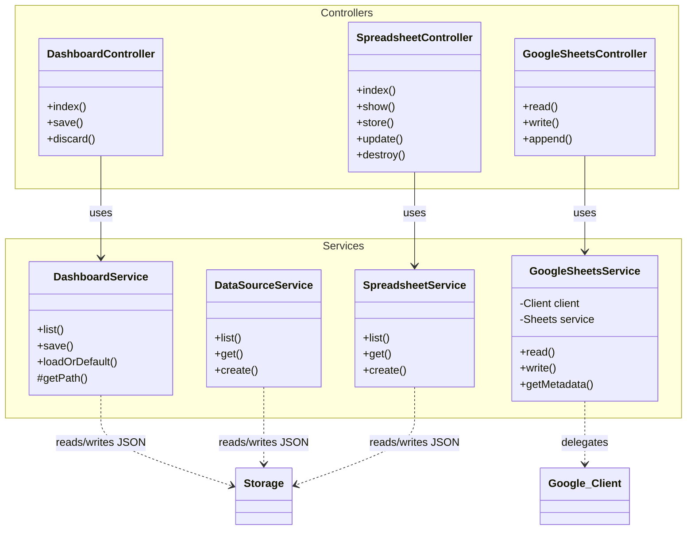

# Project Dependency Mapping

This document provides a complete mapping of the project's dependencies, including external libraries, internal system architecture, and data flow.

## 1. System Overview

**Type:** Monolithic Web Application (Laravel + Inertia.js + React)
**Backend:** PHP 8.2+ (Laravel 12.0)
**Frontend:** React 19 (TypeScript, Vite, Tailwind CSS)
**Data Storage:** Local Filesystem (JSON) + Google Sheets (External)

### High-Level Architecture

The application acts as a Dashboard Builder.
1.  **Frontend:** A React-based SPA served via Inertia.js. It provides a drag-and-drop interface for building dashboards.
2.  **Backend:** Laravel serves the initial HTML, handles routing, and provides API endpoints for data retrieval and persistence.
3.  **Persistence:** Instead of a traditional SQL database for application data, the system currently uses the local filesystem (`storage/app/`) to store Dashboard configurations, Data Sources, and Spreadsheet metadata as JSON files.
4.  **Integration:** Connects to Google Sheets via the Google API Client to fetch real-time data for charts.

---

## 2. Backend Dependencies (PHP)

### External Packages (`composer.json`)

| Package | Version | Purpose |
| :--- | :--- | :--- |
| **`laravel/framework`** | `^12.0` | Core Web Framework. |
| **`inertiajs/inertia-laravel`** | `^2.0` | Server-side adapter for Inertia.js (connects Laravel to React). |
| **`google/apiclient`** | `2.15` | Google Cloud Client Library. Used to read/write Google Sheets. |
| `laravel/tinker` | `^2.10` | Interactive REPL for debugging. |
| `pestphp/pest` | `^4.1` | Testing framework (Dev dependency). |

### Internal Architecture

The backend follows a standard MVC pattern but relies heavily on **Services** for logic and **Filesystem** for storage.

#### Controller -> Service Map

| Controller | Service Dependency | Responsibility |
| :--- | :--- | :--- |
| `DashboardController` | `DashboardService` | CRUD for Workspace/Dashboard JSON files. |
| `DataSourceController` | `DataSourceService` | CRUD for Data Source configurations. |
| `SpreadsheetController` | `SpreadsheetService` | CRUD for Spreadsheet metadata. |
| `GoogleSheetsController`| `GoogleSheetsService`| Proxy for Google Sheets API (Read/Write/Append). |

#### Data Flow (Backend)

*   **Dashboard Save:** `DashboardController::save` -> `DashboardService::save` -> Writes `storage/app/dashboards/{id}.json`.
*   **Google Sheet Read:** `GoogleSheetsController::read` -> `GoogleSheetsService::read` -> `Google_Service_Sheets` -> **Google API**.

---

## 3. Frontend Dependencies (Node.js)

### External Packages (`package.json`)

#### Core & UI
| Package | Purpose |
| :--- | :--- |
| **`react`**, **`react-dom`** | UI Library (v19). |
| **`@inertiajs/react`** | Client-side adapter for Inertia.js. |
| **`vite`** | Build tool and dev server. |
| **`tailwindcss`** | Utility-first CSS framework (v4.0). |
| **`@radix-ui/*`** | Headless UI primitives (Dialog, Select, Tabs, etc.). |
| **`lucide-react`** | Icon set. |

#### Data Visualization & Features
| Package | Purpose |
| :--- | :--- |
| **`chart.js`**, **`react-chartjs-2`**| Charting library (Likely legacy or alternative). |
| **`recharts`** | Primary charting library used in `ChartComponent`. |
| **`jspdf`**, **`html2canvas`** | PDF Generation. |
| **`zod`** | Schema validation. |
| **`class-variance-authority`** | Component variant management (styling). |

### Component Hierarchy (Key Components)

*   **`Dashboard.tsx`** (Page)
    *   `ArtboardProvider` (Context)
    *   `DragDropProvider` (Context)
    *   `ComponentSidebar` (Widget Palette)
    *   `ArtboardCanvas` (Main Drag & Drop Area)
        *   `DirectComponent` (Wrapper for widgets)
            *   **`ChartComponent`** (Visualizes data)
                *   Uses `useGoogleSheetsData` (Hook) to fetch data.
                *   Uses `recharts` (Library) to render.

---

## 4. Visual Dependency Map (Mermaid)

```mermaid
graph TD
    subgraph Frontend [Frontend (React/Inertia)]
        Page_Dashboard[Page: Dashboard.tsx]
        Page_Welcome[Page: Welcome.tsx]

        subgraph Contexts
            Ctx_Artboard[ArtboardProvider]
            Ctx_DragDrop[DragDropProvider]
        end

        subgraph Components
            Comp_Sidebar[ComponentSidebar]
            Comp_Canvas[ArtboardCanvas]
            Comp_Chart[ChartComponent]
        end

        subgraph Hooks
            Hook_Sheets[useGoogleSheetsData]
        end

        Page_Dashboard --> Ctx_Artboard
        Ctx_Artboard --> Ctx_DragDrop
        Ctx_DragDrop --> Comp_Sidebar
        Ctx_DragDrop --> Comp_Canvas
        Comp_Canvas --> Comp_Chart
        Comp_Chart --> Hook_Sheets
    end

    subgraph Backend [Backend (Laravel)]
        subgraph Controllers
            Ctrl_Dash[DashboardController]
            Ctrl_DS[DataSourceController]
            Ctrl_Sheet[GoogleSheetsController]
        end

        subgraph Services
            Svc_Dash[DashboardService]
            Svc_DS[DataSourceService]
            Svc_GSheet[GoogleSheetsService]
        end

        subgraph Storage [Local Storage / JSON]
            File_Dash[dashboards/*.json]
            File_DS[data-sources/*.json]
        end
    end

    subgraph External [External Services]
        GoogleAPI[Google Sheets API]
    end

    %% Routing / Data Flow
    Page_Dashboard == Inertia Requests ==> Ctrl_Dash
    Hook_Sheets == API Requests ==> Ctrl_Sheet

    %% Controller -> Service
    Ctrl_Dash --> Svc_Dash
    Ctrl_DS --> Svc_DS
    Ctrl_Sheet --> Svc_GSheet

    %% Service -> Storage/External
    Svc_Dash --> File_Dash
    Svc_DS --> File_DS
    Svc_GSheet -- API Client --> GoogleAPI

    classDef react fill:#61dafb,stroke:#333,stroke-width:2px,color:black;
    classDef laravel fill:#ff2d20,stroke:#333,stroke-width:2px,color:white;
    classDef storage fill:#f1c40f,stroke:#333,stroke-width:2px,color:black;
    classDef external fill:#2ecc71,stroke:#333,stroke-width:2px,color:white;

    class Page_Dashboard,Page_Welcome,Ctx_Artboard,Ctx_DragDrop,Comp_Sidebar,Comp_Canvas,Comp_Chart,Hook_Sheets react;
    class Ctrl_Dash,Ctrl_DS,Ctrl_Sheet,Svc_Dash,Svc_DS,Svc_GSheet laravel;
    class File_Dash,File_DS storage;
    class GoogleAPI external;
```

## 5. Backend Class Diagram


