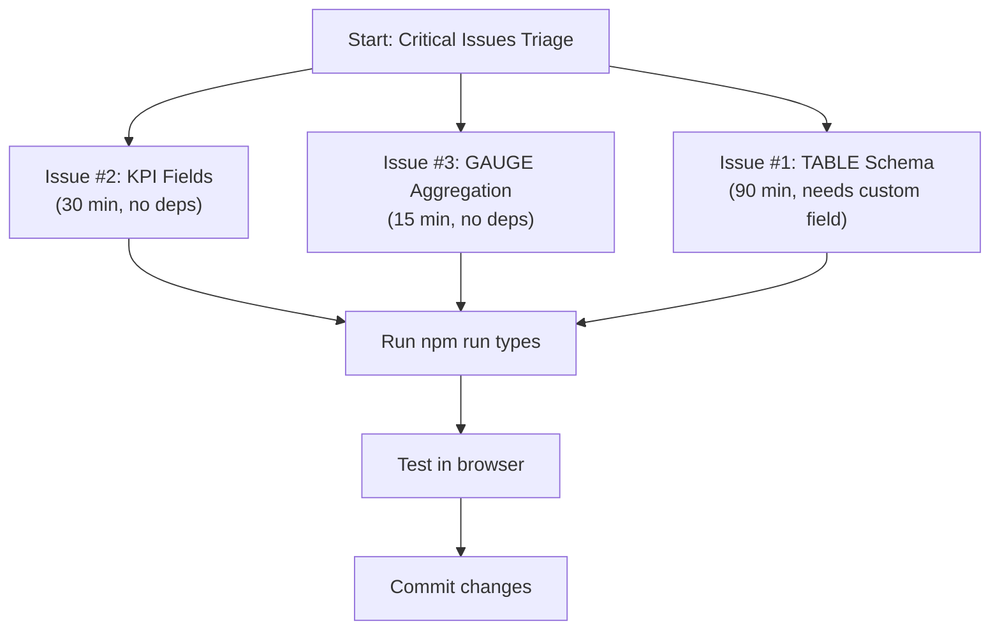

# Widgets Issues Mitigation Plan

**Date**: 2026-02-05  
**Status**: Planning Phase  
**Priority**: Critical (3 issues) + Moderate (6 issues)

---

## 🎯 Critical Issues Mitigation

### Issue #1: TABLE Schema Incomplete

**Current State**:
- `TABLE_SCHEMA` only defines 2 fields: `dataSource` and `columns`
- Component supports 9+ display options: `showTitle`, `showHeader`, `striped`, `bordered`, `compact`, `pageSize`, `showPagination`, `sortable`, `filterable`, `searchable`
- `columns` field type is `multi-select`, but component expects `TableColumnConfig[]` (complex objects)

**Impact**:
- Users cannot configure table display options from inspector
- Column formatting/width/alignment not editable
- Table always uses defaults (no header, no pagination, no striping)

**Mitigation Steps**:

#### Step 1: Expand TABLE_SCHEMA in widget-schemas.ts

File: `resources/js/modules/Widgets/types/widget-schemas.ts`

Replace the TABLE_SCHEMA definition (around line 771-784):

```typescript
export const TABLE_SCHEMA: ComponentConfigSchema = {
    componentType: 'table',
    label: 'Table',
    fields: [
        // Data Source
        DATA_SOURCE_FIELD,
        
        // Column Configuration
        {
            key: 'columns',
            label: 'Columns',
            type: 'table-columns',  // NEW: Custom field type
            group: 'Data',
            description: 'Configure which columns to display and their formatting',
        },
        
        // Display Options
        {
            key: 'title',
            label: 'Title',
            type: 'text',
            group: 'Display',
            description: 'Table title (optional)',
        },
        {
            key: 'showTitle',
            label: 'Show Title',
            type: 'boolean',
            defaultValue: false,
            group: 'Display',
        },
        {
            key: 'showHeader',
            label: 'Show Header',
            type: 'boolean',
            defaultValue: true,
            group: 'Display',
        },
        {
            key: 'striped',
            label: 'Striped Rows',
            type: 'boolean',
            defaultValue: false,
            group: 'Display',
            description: 'Alternate row colors',
        },
        {
            key: 'bordered',
            label: 'Bordered',
            type: 'boolean',
            defaultValue: false,
            group: 'Display',
            description: 'Show cell borders',
        },
        {
            key: 'compact',
            label: 'Compact Mode',
            type: 'boolean',
            defaultValue: false,
            group: 'Display',
            description: 'Reduce padding and font size',
        },
        
        // Pagination
        {
            key: 'showPagination',
            label: 'Show Pagination',
            type: 'boolean',
            defaultValue: false,
            group: 'Settings',
        },
        {
            key: 'pageSize',
            label: 'Page Size',
            type: 'number',
            defaultValue: 10,
            min: 1,
            max: 100,
            group: 'Settings',
            showWhen: { field: 'showPagination', operator: 'equals', value: true },
        },
        
        // Features
        {
            key: 'sortable',
            label: 'Sortable Columns',
            type: 'boolean',
            defaultValue: false,
            group: 'Settings',
            description: 'Allow users to click headers to sort',
        },
        {
            key: 'filterable',
            label: 'Filterable',
            type: 'boolean',
            defaultValue: false,
            group: 'Settings',
            description: 'Show filter inputs above table',
        },
        {
            key: 'searchable',
            label: 'Searchable',
            type: 'boolean',
            defaultValue: false,
            group: 'Settings',
            description: 'Show global search box',
        },
    ],
};
```

#### Step 2: Create Custom TableColumnsField Handler

File: `resources/js/modules/DataLayer/components/TableColumnsField.tsx` (NEW)

```typescript
import { Button } from '@/modules/DesignSystem/ui/button';
import { Input } from '@/modules/DesignSystem/ui/input';
import { Select, SelectContent, SelectItem, SelectTrigger, SelectValue } from '@/modules/DesignSystem/ui/select';
import { Trash2, Plus } from 'lucide-react';
import type { TableColumnConfig } from '@/modules/DataLayer/types/component-config';

export interface TableColumnsFieldProps {
  columns: TableColumnConfig[];
  onChange: (columns: TableColumnConfig[]) => void;
}

export function TableColumnsField({ columns, onChange }: TableColumnsFieldProps) {
  const handleAddColumn = () => {
    const newColumn: TableColumnConfig = {
      field: `column_${Date.now()}`,
      header: 'New Column',
      formatType: 'text',
    };
    onChange([...columns, newColumn]);
  };

  const handleUpdateColumn = (index: number, updates: Partial<TableColumnConfig>) => {
    const updated = [...columns];
    updated[index] = { ...updated[index], ...updates };
    onChange(updated);
  };

  const handleDeleteColumn = (index: number) => {
    onChange(columns.filter((_, i) => i !== index));
  };

  return (
    <div className="space-y-3">
      <div className="space-y-2">
        {columns.map((col, idx) => (
          <div key={idx} className="flex gap-2 items-start p-2 rounded border bg-muted/30">
            <div className="flex-1 space-y-2">
              <Input
                type="text"
                placeholder="Field name"
                value={col.field}
                onChange={(e) => handleUpdateColumn(idx, { field: e.target.value })}
                className="h-7 text-sm"
              />
              <Input
                type="text"
                placeholder="Column header"
                value={col.header}
                onChange={(e) => handleUpdateColumn(idx, { header: e.target.value })}
                className="h-7 text-sm"
              />
              <Select
                value={col.formatType || 'text'}
                onValueChange={(v) => handleUpdateColumn(idx, { formatType: v as any })}
              >
                <SelectTrigger className="h-7 text-sm">
                  <SelectValue />
                </SelectTrigger>
                <SelectContent>
                  {['text', 'number', 'currency', 'date', 'percent'].map((t) => (
                    <SelectItem key={t} value={t}>
                      {t.charAt(0).toUpperCase() + t.slice(1)}
                    </SelectItem>
                  ))}
                </SelectContent>
              </Select>
            </div>
            <Button
              variant="ghost"
              size="icon"
              className="h-7 w-7 mt-2"
              onClick={() => handleDeleteColumn(idx)}
            >
              <Trash2 className="h-3 w-3" />
            </Button>
          </div>
        ))}
      </div>

      <Button
        variant="outline"
        size="sm"
        onClick={handleAddColumn}
        className="w-full"
      >
        <Plus className="h-3 w-3 mr-1" /> Add Column
      </Button>
    </div>
  );
}
```

#### Step 3: Update ConfigField to Handle `table-columns` Type

File: `resources/js/modules/DataLayer/components/ConfigField.tsx`

Add import at top:
```typescript
import { TableColumnsField } from './TableColumnsField';
```

Add case in ConfigField component:
```typescript
if (field.type === 'table-columns') {
  return (
    <TableColumnsField
      columns={Array.isArray(value) ? value : []}
      onChange={onChange}
    />
  );
}
```

#### Step 4: Update TableComponent to Use Schema-Driven Defaults

File: `resources/js/modules/Widgets/components/TableComponent.tsx`

Update the rendering to respect all schema options (lines 80-120):

```typescript
return (
  <div className={cn(
    'h-full w-full overflow-auto',
    safeConfig.striped && 'striped-rows',
    safeConfig.bordered && 'bordered-table',
    safeConfig.compact && 'compact-table'
  )}>
    {/* Title */}
    {safeConfig.showTitle && safeConfig.title && (
      <div className="px-4 py-2 border-b">
        <h3 className="text-sm font-semibold">{safeConfig.title}</h3>
      </div>
    )}

    {/* Search Bar */}
    {safeConfig.searchable && (
      <div className="px-4 py-2 border-b">
        <input
          type="text"
          placeholder="Search..."
          className="w-full px-2 py-1 text-sm border rounded"
          onChange={(e) => setSearchTerm(e.target.value)}
        />
      </div>
    )}

    {/* Table */}
    <table className={cn(
      'w-full text-sm',
      !safeConfig.showHeader && 'no-header'
    )}>
      {safeConfig.showHeader && (
        <thead>
          <tr className={safeConfig.striped ? 'bg-muted' : ''}>
            {columns.map((col) => (
              <th
                key={col.field}
                className="px-4 py-2 text-left font-medium cursor-pointer hover:bg-muted/50"
                onClick={() => safeConfig.sortable && handleSort(col.field)}
              >
                {col.header}
              </th>
            ))}
          </tr>
        </thead>
      )}
      <tbody>
        {/* Render rows with striped styling */}
      </tbody>
    </table>

    {/* Pagination */}
    {safeConfig.showPagination && (
      <div className="px-4 py-2 border-t flex justify-between items-center">
        {/* Pagination controls */}
      </div>
    )}
  </div>
);
```

**Timeline**: 1-2 hours  
**Risk**: Low (new fields are optional, existing behavior unchanged)

---

### Issue #2: KPI Schema Missing Fields

**Current State**:
- Schema is missing `prefix` and `suffix` (for "$", "%", etc.)
- Schema has unused trend fields: `showTrend`, `trendField`, `trendPeriod`
- Component only supports manual trend, not computed trend

**Impact**:
- Users cannot add currency symbols or units ($, RM, %)
- Misleading schema suggests trend computation that doesn't work

**Mitigation Steps**:

#### Step 1: Remove/Fix Unused Trend Fields

Option A: Implement trend computation (complex, future work)
Option B: Remove from schema (recommended for now)

File: `resources/js/modules/DataLayer/types/component-config.ts`

Replace KPI_SCHEMA (around line 674-738) to remove unused trend fields:

```typescript
export const KPI_SCHEMA: ComponentConfigSchema = {
    componentType: 'kpi',
    label: 'KPI Metric',
    fields: [
        DATA_SOURCE_FIELD,
        {
            key: 'valueField',
            label: 'Value Column',
            type: 'column-picker',
            group: 'Data',
            description: 'Column containing the metric value',
            showWhen: { field: 'dataSource.type', operator: 'not-equals', value: 'static' },
        },
        {
            key: 'title',
            label: 'Title',
            type: 'text',
            defaultValue: 'Metric',
            group: 'Display',
        },
        {
            key: 'aggregation',
            label: 'Aggregation',
            type: 'select',
            defaultValue: 'sum',
            group: 'Data',
            options: [
                { value: 'sum', label: 'Sum' },
                { value: 'count', label: 'Count' },
                { value: 'average', label: 'Average' },
                { value: 'min', label: 'Minimum' },
                { value: 'max', label: 'Maximum' },
            ],
        },
        // NEW: Prefix/Suffix for formatting
        {
            key: 'prefix',
            label: 'Prefix',
            type: 'text',
            group: 'Display',
            description: 'Text before value (e.g., "$")',
        },
        {
            key: 'suffix',
            label: 'Suffix',
            type: 'text',
            group: 'Display',
            description: 'Text after value (e.g., "%")',
        },
        {
            key: 'decimals',
            label: 'Decimal Places',
            type: 'number',
            defaultValue: 0,
            min: 0,
            max: 4,
            group: 'Display',
        },
        {
            key: 'formatType',
            label: 'Format',
            type: 'select',
            defaultValue: 'number',
            group: 'Display',
            options: [
                { value: 'number', label: 'Number' },
                { value: 'currency', label: 'Currency' },
                { value: 'percent', label: 'Percentage' },
            ],
        },
        {
            key: 'currencyCode',
            label: 'Currency',
            type: 'select',
            defaultValue: 'MYR',
            group: 'Display',
            options: [
                { value: 'MYR', label: 'MYR (RM)' },
                { value: 'USD', label: 'USD ($)' },
                { value: 'EUR', label: 'EUR (€)' },
                { value: 'GBP', label: 'GBP (£)' },
            ],
            showWhen: { field: 'formatType', operator: 'equals', value: 'currency' },
        },
        {
            key: 'trendValue',
            label: 'Trend Value',
            type: 'number',
            defaultValue: 0,
            group: 'Display',
            description: 'Manual trend override (optional)',
        },
        {
            key: 'trendType',
            label: 'Trend Direction',
            type: 'select',
            defaultValue: 'neutral',
            group: 'Display',
            options: [
                { value: 'up', label: 'Up (Good)' },
                { value: 'down', label: 'Down (Bad)' },
                { value: 'neutral', label: 'Neutral' },
            ],
        },
        ...COLOR_FIELDS,
    ],
};
```

#### Step 2: Update component-config.ts to Remove Unused Fields

File: `resources/js/modules/DataLayer/types/component-config.ts`

Find KpiConfig interface (around line 330-350) and remove unused fields:

```typescript
export interface KpiConfig {
  dataSource: DataSource;
  valueField?: string;

  // Display
  title?: string;
  prefix?: string;        // NEW
  suffix?: string;        // NEW
  decimals?: number;      // NEW

  // Manual trend only (no computed trend for now)
  trendValue?: number;
  trendType?: 'up' | 'down' | 'neutral';

  // Formatting
  aggregation?: AggregationType;
  formatType?: 'number' | 'currency' | 'percent';
  currencyCode?: string;

  // Styling
  valueColor?: string;
  trendUpColor?: string;
  trendDownColor?: string;
}
```

#### Step 3: Update KpiComponent to Use prefix/suffix

File: `resources/js/modules/Widgets/components/KpiComponent.tsx`

Update the display value construction (around line 140-160):

```typescript
// Format the main value
const formattedValue = formatNumber(mainValue, {
  decimals: safeConfig.decimals ?? 0,
  style:
    safeConfig.formatType === 'currency'
      ? 'currency'
      : safeConfig.formatType === 'percent'
        ? 'percent'
        : 'decimal',
  currency: safeConfig.currencyCode || 'USD',
});

// Build display string with prefix/suffix (NEW)
const displayValue = `${safeConfig.prefix || ''}${formattedValue}${safeConfig.suffix || ''}`;
```

**Timeline**: 30 minutes  
**Risk**: Low (adding fields, safe default for removed unused fields)

---

### Issue #3: GAUGE Hardcodes Aggregation

**Current State**:
- GaugeChartComponent.tsx hardcodes `aggregation: 'sum'` in the hook call (line 94)
- No schema field to override
- Users cannot choose count/average/min/max

**Impact**:
- Gauge always sums values, even when average/count would be more appropriate
- For a single metric, sum is often wrong

**Mitigation Steps**:

#### Step 1: Add aggregation Field to GAUGE_SCHEMA

File: `resources/js/modules/Widgets/types/widget-schemas.ts`

Find GAUGE_SCHEMA (around line 593-620) and add aggregation field:

```typescript
export const GAUGE_SCHEMA: ComponentConfigSchema = {
    componentType: 'gauge',
    label: 'Gauge Chart',
    fields: [
        DATA_SOURCE_FIELD,
        {
            key: 'valueField',
            label: 'Value Column',
            type: 'column-picker',
            group: 'Data',
            description: 'Column containing the metric value',
        },
        {
            key: 'min',
            label: 'Minimum Value',
            type: 'number',
            defaultValue: 0,
            group: 'Data',
        },
        {
            key: 'max',
            label: 'Maximum Value',
            type: 'number',
            defaultValue: 100,
            group: 'Data',
        },
        // NEW: Aggregation field
        {
            key: 'aggregation',
            label: 'Aggregation',
            type: 'select',
            defaultValue: 'sum',
            group: 'Data',
            options: [
                { value: 'sum', label: 'Sum' },
                { value: 'count', label: 'Count' },
                { value: 'average', label: 'Average' },
                { value: 'min', label: 'Minimum' },
                { value: 'max', label: 'Maximum' },
            ],
            description: 'How to combine multiple values',
        },
        {
            key: 'title',
            label: 'Title',
            type: 'text',
            defaultValue: 'Gauge',
            group: 'Display',
        },
        ...COLOR_FIELDS,
    ],
};
```

#### Step 2: Update component-config.ts GaugeChartConfig

File: `resources/js/modules/DataLayer/types/component-config.ts`

Find GaugeChartConfig interface and add aggregation:

```typescript
export interface GaugeChartConfig {
  dataSource: DataSource;
  valueField?: string;
  min?: number;
  max?: number;
  aggregation?: AggregationType;      // NEW
  formatType?: 'number' | 'currency' | 'percent';
  currencyCode?: string;
  colors?: { primary?: string; track?: string };
  showValue?: boolean;
  showLabel?: boolean;
  label?: string;
}
```

#### Step 3: Update GaugeChartComponent to Use Config Aggregation

File: `resources/js/modules/Widgets/components/GaugeChartComponent.tsx`

Replace the hardcoded aggregation (around line 93-100):

```typescript
// Before:
const {
  data: fetchedData,
  loading,
  error,
} = useGoogleSheetsData({
  dataSource: dataSource.type === 'google-sheets' ? dataSource : { type: 'google-sheets', spreadsheetId: '', sheetName: '', range: '' },
  aggregation: 'sum',  // HARDCODED
});

// After:
const {
  data: fetchedData,
  loading,
  error,
} = useGoogleSheetsData({
  dataSource: dataSource.type === 'google-sheets' ? dataSource : { type: 'google-sheets', spreadsheetId: '', sheetName: '', range: '' },
  aggregation: safeConfig.aggregation || 'sum',  // FROM CONFIG
});
```

**Timeline**: 15 minutes  
**Risk**: Very low (adds optional field, defaults to current behavior)

---

## 🔄 Implementation Sequence



**Recommended Order** (maximize parallelization):
1. Start Issue #2 (KPI) + Issue #3 (GAUGE) in parallel
2. While those compile, start Issue #1 (TABLE)
3. Compile and test all together

**Total Timeline**: ~2 hours (1:30 coding + 0:30 testing + 0:00 overhead)

---

## 🧾 Data Quality Assumptions (Raw, Human-Typed)

**Context**: Source data is manually entered in Google Sheets. Expect type drift and inconsistent formatting.

**Why this matters**:
- Columns intended as numbers can be strings (e.g., "4800.00", "100 MYR")
- Dates may be placeholders (e.g., `1/1/1900` used as "undefined")
- Percent fields may contain non-percent data or mismatched formats
- Mixed types in a single column can break aggregation and formatting silently

**Planning Implications**:
1. Validate and coerce types before aggregation/formatting
2. Treat `1/1/1900` and `12/30/1899` as **null sentinel dates**, not real values
3. Surface warnings in the inspector for mixed-type columns
4. Allow users to override detected column types

---

## ✅ Testing Strategy

### Unit Tests (if applicable)
- [ ] TABLE schema fields all render without errors
- [ ] KPI prefix/suffix appear in formatted output
- [ ] GAUGE aggregation changes affect computed value

### Manual Testing
1. Create test widgets of each type
2. For TABLE: Add/remove columns, toggle display options
3. For KPI: Set prefix="$", suffix="%", verify formatting
4. For GAUGE: Change aggregation, verify value changes

### Regression Testing
- [ ] Existing chart schemas still work (no breaking changes)
- [ ] Default values produce expected output
- [ ] Conditional visibility still works (showWhen logic)

### Browser Testing
- [ ] InspectorPanel renders without errors
- [ ] Fields appear in correct order/group
- [ ] Values persist when switching between widgets

---

## 📊 Risk Assessment

| Issue | Risk Level | Impact of Delay | Mitigation |
|-------|-----------|-----------------|-----------|
| TABLE schema |🟡 Medium | High: UX broken for table config | Well-scoped, known requirements |
| KPI fields | 🟢 Low | Medium: Missing formatting | Simple field additions |
| GAUGE aggregation | 🟢 Low | Low: Workaround exists (hardcoded) | Backward compatible |

**Overall Risk**: Low → Medium
- No breaking changes
- All changes are additive (optional fields)
- Existing dashboards continue to work

---

## 📝 Documentation Updates Needed

After implementation, update:

1. **WIDGETS_COMPREHENSIVE_MAP.md**: Mark issues as RESOLVED
2. **Code comments**: Add JSDoc to new fields explaining intent
3. **README**: Document new table-columns custom field type
4. **CHANGELOG**: Log schema additions

---

## 🚀 Rollout Plan

### Phase 1: Implementation (Day 1)
- [ ] Code all 3 issues in feature branch
- [ ] Run `npm run types` and verify no TS errors
- [ ] Commit: "fix(widgets): expand TABLE, KPI, GAUGE schemas"

### Phase 2: Testing (Day 1-2)
- [ ] Manual testing in browser
- [ ] Create example dashboards with new features
- [ ] Verify existing dashboards still work

### Phase 3: Merge (Day 2)
- [ ] Create PR with all changes
- [ ] Code review if possible
- [ ] Merge to main

### Phase 4: Monitor (Day 3+)
- [ ] Deploy to production
- [ ] Monitor for errors
- [ ] Fix any edge cases

---

## ⚠️ Known Edge Cases

1. **TABLE columns with missing fields**: Handle gracefully in rendering
2. **KPI prefix with currency format**: Both "$" from prefix and currency formatter might apply
   - Recommendation: Make prefix/suffix override currency symbol
3. **GAUGE min > max**: Component should validate and provide error message
   - Consider adding validation in GaugeChartComponent

---

## 📋 Checklist for Completion

- [ ] All code changes implemented
- [ ] TypeScript compilation succeeds (`npm run types`)
- [ ] ESLint passes (`npm run lint`)
- [ ] Manual testing completed
- [ ] Browser testing verified
- [ ] Documentation updated
- [ ] Changes committed with clear messages
- [ ] WIDGETS_COMPREHENSIVE_MAP.md updated to mark as resolved
