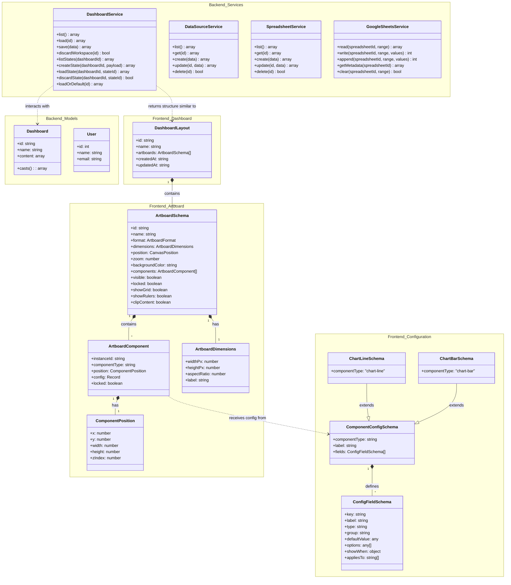

# Project Class Diagram

This diagram represents the core structure of the project, covering both the Backend (Laravel) services/models and the Frontend (React/TypeScript) domain entities.

```mermaid
classDiagram
    namespace Backend_Models {
        class Dashboard {
            +id: string
            +name: string
            +content: array
            +casts(): array
        }
        class User {
            +id: int
            +name: string
            +email: string
        }
    }

    namespace Backend_Services {
        class DashboardService {
            +list() array
            +load(id) array
            +save(data) array
            +discardWorkspace(id) bool
            +listStates(dashboardId) array
            +createState(dashboardId, payload) array
            +loadState(dashboardId, stateId) array
            +discardState(dashboardId, stateId) bool
            +loadOrDefault(id) array
        }
        
        class DataSourceService {
            +list() array
            +get(id) array
            +create(data) array
            +update(id, data) array
            +delete(id) bool
        }

        class SpreadsheetService {
            +list() array
            +get(id) array
            +create(data) array
            +update(id, data) array
            +delete(id) bool
        }
        
        class GoogleSheetsService {
             +read(spreadsheetId, range) array
             +write(spreadsheetId, range, values) int
             +append(spreadsheetId, range, values) int
             +getMetadata(spreadsheetId) array
             +clear(spreadsheetId, range) bool
        }
    }

    namespace Frontend_Dashboard {
        class DashboardLayout {
            +id: string
            +name: string
            +artboards: ArtboardSchema[]
            +createdAt: string
            +updatedAt: string
        }
    }

    namespace Frontend_Artboard {
        class ArtboardSchema {
            +id: string
            +name: string
            +format: ArtboardFormat
            +dimensions: ArtboardDimensions
            +position: CanvasPosition
            +zoom: number
            +backgroundColor: string
            +components: ArtboardComponent[]
            +visible: boolean
            +locked: boolean
            +showGrid: boolean
            +showRulers: boolean
            +clipContent: boolean
        }

        class ArtboardComponent {
            +instanceId: string
            +componentType: string
            +position: ComponentPosition
            +config: Record
            +locked: boolean
        }

        class ComponentPosition {
            +x: number
            +y: number
            +width: number
            +height: number
            +zIndex: number
        }

        class ArtboardDimensions {
            +widthPx: number
            +heightPx: number
            +aspectRatio: number
            +label: string
        }
    }

    namespace Frontend_Configuration {
        class ComponentConfigSchema {
            +componentType: string
            +label: string
            +fields: ConfigFieldSchema[]
        }

        class ConfigFieldSchema {
            +key: string
            +label: string
            +type: string
            +group: string
            +defaultValue: any
            +options: any[]
            +showWhen: object
            +appliesTo: string[]
        }
        
        class ChartLineSchema {
            +componentType: "chart-line"
        }
        class ChartBarSchema {
            +componentType: "chart-bar"
        }
    }

    %% Relationships
    DashboardService ..> Dashboard : interacts with
    DashboardService ..> DashboardLayout : returns structure similar to
    
    DashboardLayout "1" *-- "*" ArtboardSchema : contains
    ArtboardSchema "1" *-- "*" ArtboardComponent : contains
    ArtboardSchema "1" *-- "1" ArtboardDimensions : has
    ArtboardComponent "1" *-- "1" ComponentPosition : has
    
    ArtboardComponent ..> ComponentConfigSchema : receives config from
    ComponentConfigSchema "1" *-- "*" ConfigFieldSchema : defines
    
    ChartLineSchema --|> ComponentConfigSchema : extends
    ChartBarSchema --|> ComponentConfigSchema : extends
```
